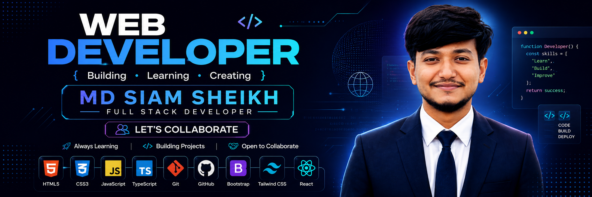

<p align="center">
  
</p>

<h1 align="center">Hi 👋, I'm MD Siam Sheikh</h1>

<p align="center">
  <strong>Aspiring Frontend Developer</strong>
</p>

<p align="center">
  HTML • CSS • JavaScript • TypeScript • React
</p>

<p align="center">
  Building responsive, user-focused web experiences while continuously
  improving my development skills through hands-on projects.
</p>

<p align="center">
  <a href="https://github.com/mdsiamsheikh13">
    
  </a>
  <a href="https://www.linkedin.com/in/md-siam-sheikh01">
    
  </a>
  <a href="mailto:mdsiamsheikh8@gmail.com">
    
  </a>
</p>

---

## 👨‍💻 About Me

I'm a Computer Science and Engineering student working toward becoming a professional web developer.

My current focus is frontend development, where I'm building a strong foundation in modern web technologies and learning how to turn ideas into responsive, interactive, and user-friendly applications.

* 🎓 Computer Science & Engineering student
* 💻 Aspiring Frontend Developer
* ⚛️ Currently learning **React**
* 🧱 Strong focus on frontend fundamentals
* 🛠️ Learning by building real projects
* 🔀 Comfortable with Git & GitHub workflows
* 🚀 Working toward full-stack web development
* 🤖 Interested in responsible and effective AI-assisted development

---

## 🛠️ Skills & Technologies

### ✅ Technologies I've Learned

<p align="center">
  
</p>

<table align="center">
  <tr>
    <td align="center"><strong>HTML5</strong></td>
    <td align="center"><strong>CSS3</strong></td>
    <td align="center"><strong>JavaScript</strong></td>
    <td align="center"><strong>TypeScript</strong></td>
  </tr>
  <tr>
    <td align="center"><strong>Tailwind CSS</strong></td>
    <td align="center"><strong>Bootstrap</strong></td>
    <td align="center"><strong>Git</strong></td>
    <td align="center"><strong>GitHub</strong></td>
  </tr>
</table>

---

### 🟡 Currently Learning

<p align="center">
  
</p>

<h3 align="center">⚛️ React</h3>

<p align="center">
  Learning to build interactive, component-based and reusable web applications.
</p>

**Current focus:**

* JSX
* Components
* Props
* State
* Event Handling
* Conditional Rendering
* Hooks
* API Data Fetching
* Reusable Components
* Component-based application structure

---

### 🔜 Upcoming Learning

These technologies are part of my planned learning journey and are **not being presented as skills I have already mastered**.

<p align="center">
  
</p>

**Next.js** • **BetterAuth** • **Node.js** • **MongoDB** • **Mongoose**

Later, I plan to explore:

* 🤖 AI Mindset & Engineering
* 🤖 AI-Assisted Coding

---

## 🧭 My Learning Journey

```text
HTML
  │
  ▼
CSS
  │
  ▼
JavaScript
  │
  ▼
TypeScript
  │
  ├── Tailwind CSS
  ├── Bootstrap
  │
  ▼
Git & GitHub
  │
  ▼
React ⚛️
  │
  ▼
Next.js
  │
  ▼
BetterAuth
  │
  ▼
Node.js
  │
  ▼
MongoDB + Mongoose
  │
  ▼
AI Mindset & Engineering
  │
  ▼
AI-Assisted Coding
  │
  ▼
🚀 Full-Stack Web Development
```

> My goal is not to rush through technologies, but to build strong fundamentals and turn each stage of learning into practical projects.

---

## 📌 Featured Projects

A selection of projects from my web development journey.

<table>
  <tr>
    <td width="50%" valign="top">

### 🌐 DevConf 2026 Landing Page

A responsive conference landing page built to practice modern layouts, responsive design, typography, spacing, and visual presentation.

**Tech:** HTML • CSS

<a href="https://github.com/mdsiamsheikh13/DevConf-2026-landing-page">
  View Repository →
</a>

------------------------------------------------------------------------------------------------------------------------------------------------------------------------------------------------------------------------------

### 🎨 CSS Hover Effect

A collection of interactive hover effects created while practicing CSS transitions, animations, pseudo-classes, and UI interactions.

**Tech:** HTML • CSS

<a href="https://github.com/mdsiamsheikh13/CSS-Hover-Effect">
  View Repository →
</a>

------------------------------------------------------------------------------------------------------------------------------------------------------------------------------------------------------------------------------


### 🔐 Login Form UI

A responsive login interface focused on form layout, spacing, styling, and clean user-interface fundamentals.

**Tech:** HTML • CSS

<a href="https://github.com/mdsiamsheikh13/Login-Form-UI">
  View Repository →
</a>

------------------------------------------------------------------------------------------------------------------------------------------------------------------------------------------------------------------------------

### 👤 Responsive Profile Card

A responsive profile-card project created to practice layout, typography, spacing, and responsive design.

**Tech:** HTML • CSS

<a href="https://github.com/mdsiamsheikh13/Responsive-Profile-Card">
  View Repository →
</a>


------------------------------------------------------------------------------------------------------------------------------------------------------------------------------------------------------------------------------


## 📌 About My Pinned Repositories

My pinned repositories are selected to give visitors a quick overview of my development journey.

As I build stronger projects, especially with React and later Next.js, I plan to continuously replace smaller practice projects with more complete and production-oriented applications.

**Current priority:**

```text
Practice Projects
      ↓
Stronger JavaScript Projects
      ↓
React Applications
      ↓
Next.js Applications
      ↓
Full-Stack Projects
```

The goal is to make my pinned repositories increasingly representative of my strongest work.

---

## 🎯 Current Focus

### ⚛️ React Development

I'm currently transitioning from traditional HTML/CSS/JavaScript projects into component-based application development with React.

My focus is on understanding the fundamentals deeply enough to build applications without simply copying solutions.

```text
Components
    ↓
JSX
    ↓
Props
    ↓
State
    ↓
Hooks
    ↓
API Integration
    ↓
Reusable Components
    ↓
Real-world React Applications
```

---

## 🚀 Future Direction

My long-term goal is to become a **Full-Stack Web Developer**.

The roadmap I'm following is:

```text
Frontend Fundamentals
        ↓
      React
        ↓
     Next.js
        ↓
 Authentication
        ↓
      Node.js
        ↓
 MongoDB + Mongoose
        ↓
 Full-Stack Applications
        ↓
 AI-Assisted Engineering
        ↓
🚀 Full-Stack Web Developer
```

---

## 📊 GitHub Activity

<p align="center">
  
</p>

<p align="center">
  
</p>

<p align="center">
  
</p>

---

## 🤝 Let's Connect

<p align="center">
  <a href="https://www.linkedin.com/in/md-siam-sheikh01">
    
  </a>

  <a href="mailto:mdsiamsheikh8@gmail.com">
    
  </a>
</p>

---

<p align="center">
  <strong>Building • Learning • Creating</strong>
</p>

<p align="center">
  <i>One project at a time. 🚀</i>
</p>
